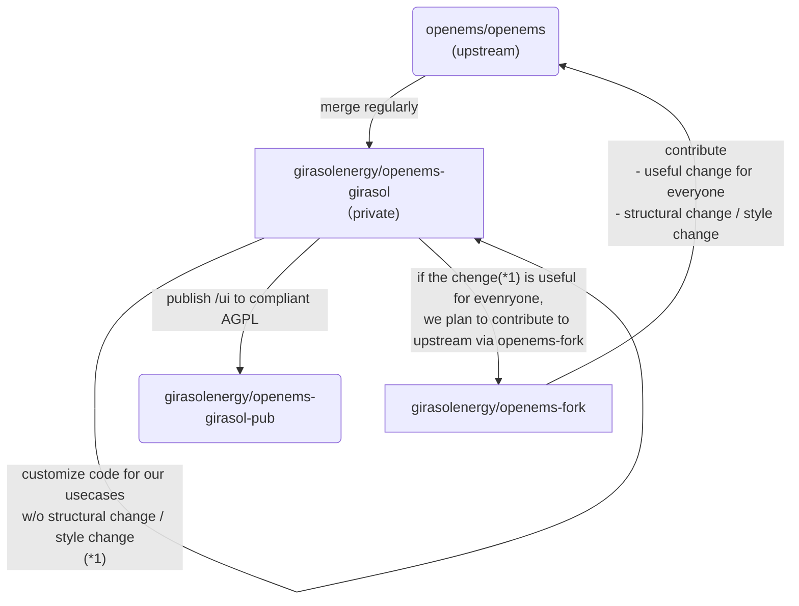

# openems-girasol-pub

## Girasol Energy OpenEMS Repository Strategy

## OSS License Compliance

For compliance of EPL-2, we have opened oss@pplc.co. When you received derived works from us then you should received code but if you have trouble please contact through the e-mail.

For compliance of AGPL-3.0, we publish the source code in this repository.
